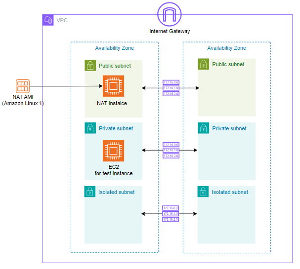
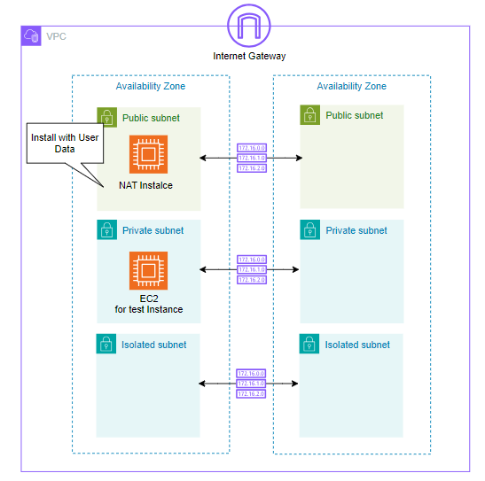

# aws-cdk-cdp

This is a sample repository of cloud design patterns on AWS CDK.

## Add usecase

```sh
npm init -w usecases\sample
cd usecases\sample
rm package.json
cdk init app --language typescript
cd ../../
cp tsconfig_usecases.json .\usecases\sample\tsconfig.json
npm install -w usecases\sample --save aws-cdk-lib constructs
```

```bat
npm init -w usecases\sample
cd usecases\sample
del package.json
cdk init app --language typescript
cd ../../
copy /y tsconfig_usecases.json .\usecases\sample\tsconfig.json
npm install -w usecases\sample --save aws-cdk-lib constructs
npm install -w usecases\sample --save-dev @types/js-yaml
```

## Samples

- env-parameter
- vpc-with-nat-ami-al1
  
- vpc-with-nat
  
- vpc-with-natgw
  
