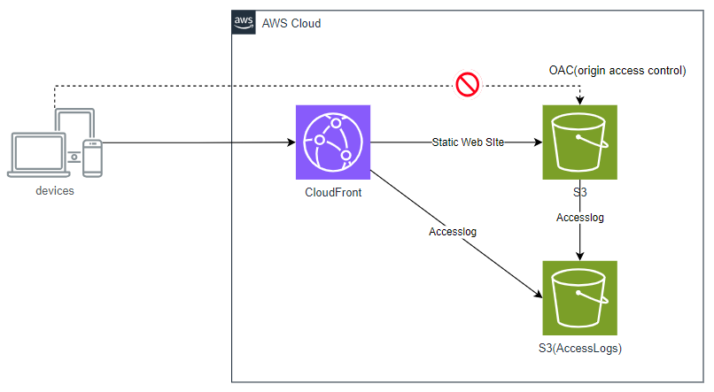

# CloudFront + S3 + OAC(origin access control)

Amazon CloudFront distribution resource with an Amazon S3 origin using an OAC (origin access control).

OAC (origin access control) を使用した Amazon S3 オリジンを持つ Amazon CloudFront ディストリビューションです。

- S3サーバーアクセスログ用S3バケット
- CloudFrontのアクセスログ用S3バケット
- Webサイトのコンテンツ用S3バケット
- CloudFront ディストリビューション
- CloudFront OACの設定
- WebサイトのサンプルコンテンツをS3バケットにアップロード
