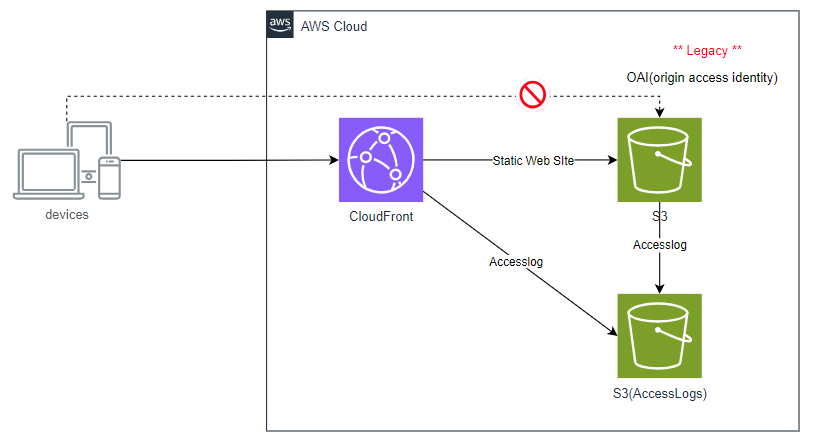

# CloudFront + S3 + OAI(origin access identity)

Amazon CloudFront distribution resource with an Amazon S3 origin using an OAI (Origin Access Identity).
This is an old implementation. OAC (Origin Access Control) is currently recommended.

OAI (Origin Access Identity) を使用した Amazon S3 オリジンを持つ Amazon CloudFront ディストリビューションです。
これは古い実装です。現在、OAC (Origin Access Control) が推奨されています。

## アーキテクチャ

- S3サーバーアクセスログ用S3バケット
- CloudFrontのアクセスログ用S3バケット
- Webサイトのコンテンツ用S3バケット
- CloudFront ディストリビューション + OAIの設定
- WebサイトのサンプルコンテンツをS3バケットにアップロード

[(Aug 25, 2022)Amazon CloudFront でオリジンアクセスコントロール (OAC) をリリース](https://aws.amazon.com/jp/about-aws/whats-new/2022/08/amazon-cloudfront-origin-access-control/)

[オリジンアクセスアイデンティティ (OAI) からオリジンアクセスコントロール (OAC) への移行](https://docs.aws.amazon.com/ja_jp/AmazonCloudFront/latest/DeveloperGuide/private-content-restricting-access-to-s3.html#migrate-from-oai-to-oac)
