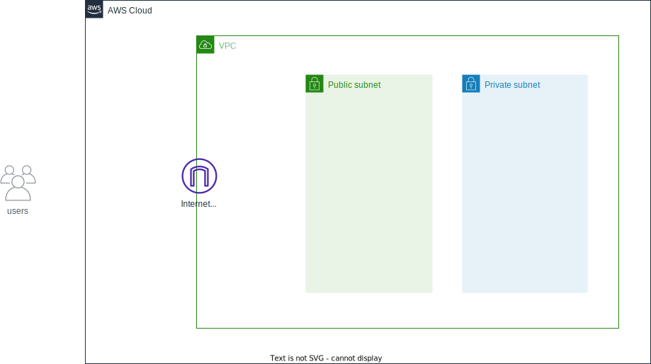

# XXXX

[日本語](README.ja.md) | English

## **Sorry!Under construction!!**

## Architecture Overview



- xxxx
- xxxx

### Key Components

- xxxx
- xxxx

## Deploy

## Test

```sh
aws logs create-log-stream \
    --log-group-name "/aws/sample/dev/application-logs" \
    --log-stream-name "test-stream"  \
    --profile your-profile-name

aws logs put-log-events  \
    --log-group-name "/aws/sample/dev/application-logs"  \
    --log-stream-name "test-stream"  \
    --log-events '[{"timestamp": '$(date +%s%3N)', "message": "{\"level\": \"ERROR\", \"message\": \"エラーテストメッセージ\"}"}]'  \
    --profile your-profile-name

aws logs put-log-events  \
    --log-group-name "/aws/sample/dev/application-logs"  \
    --log-stream-name "test-stream"  \
    --log-events '[{"timestamp": '$(date +%s%3N)', "message": "{\"level\": \"FATAL\", \"message\": \"致命的エラーテストメッセージ\"}"}]'  \
    --profile your-profile-name

aws logs put-log-events  \
    --log-group-name "/aws/sample/dev/application-logs" \
    --log-stream-name "test-stream"  \
    --log-events '[{"timestamp": '$(date +%s%3N)', "message": "{\"level\": \"INFO\", \"message\": \"テストメッセージ\"}"}]'  \
    --profile your-profile-name
```

## Usage

## Clean-up

## 料金

[XXXX - AWS 料金見積りツール](https://calculator.aws/#/estimate?id=XXXX)