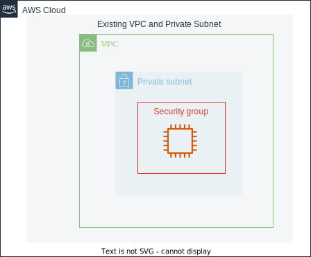

# EC2 pgAdmin Docker

Create an instance for pgAdmin in the private subnet of the specified VPC.

指定したVPCのプライベートサブネットにpgAdmin用のインスタンスを作成します

## アーキテクチャ

- EC2 インスタンス用セキュリティグループ作成
  - Inbound: 許可ルールなし
  - Outbound:すべて許可
- EC2 インスタンス用KeyPair作成
  - キーペアはパラメータストアに格納されています
- EC2 インスタンスを t4g.nano で起動
- UserData にて Docker インストールと pgAdmin コンテナを起動

## 料金

[EC2 pgAdmin Docker - AWS 料金見積りツール](https://calculator.aws/#/estimate?id=2825e5e1e4dacf6860440b5de897e5900f62bd9f)