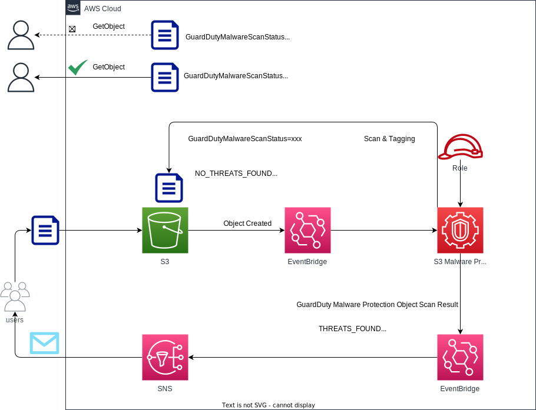

# s3-malware-protection

Create an environment to check the operation of Malware Protection for S3.

Malware Protection for S3の動作確認ための環境を構築します。

## アーキテクチャ



- S3バケットの作成
  - S3 バケットリソースポリシーに対して[スキャン結果によるアクセスコントロール](https://docs.aws.amazon.com/ja_jp/guardduty/latest/ug/tag-based-access-s3-malware-protection.html)を追加
- Malware Protection プラン用のIAMロールを作成
  - [IAM ポリシーのアクセス許可の追加](https://docs.aws.amazon.com/ja_jp/guardduty/latest/ug/malware-protection-s3-iam-policy-prerequisite.html#attach-iam-policy-s3-malware-protection)
- Malware Protection プランを作成
  - [バケットの S3 の Malware Protection を有効にする](https://docs.aws.amazon.com/ja_jp/guardduty/latest/ug/enable-malware-protection-s3-bucket.html)
- 通知用SNSトピックの作成
- スキャン結果用のEventBridgeのルールを作成
  - [S3 オブジェクトスキャンステータスのモニタリング](https://docs.aws.amazon.com/ja_jp/guardduty/latest/ug/monitor-with-eventbridge-s3-malware-protection.html)

## 前提条件

- GuardDutyが有効になっていない場合は、[GuardDuty Malware Protection for S3 を個別に開始する](https://docs.aws.amazon.com/ja_jp/guardduty/latest/ug/malware-protection-s3-get-started-independent.html)を実施

- 「.aws/credentials」に、デプロイ方法の`env`と`project`に指定するものを使ったプロファイル名`project-env`が存在すること

## デプロイ方法

```sh
npm run cdk:deploy:all --env=<environment> --project=<project name> -w usecases\s3-malware-protection
```

## 削除

```sh
npm run cdk:destroy:all --env=<environment> --project=<project name> -w usecases\s3-malware-protection
```

## 料金

[Malware Protection for S3 の料金](https://docs.aws.amazon.com/ja_jp/guardduty/latest/ug/pricing-malware-protection-for-s3-guardduty.html)

※S3 オブジェクトへのタグ付けは無料の範囲に含まれません
