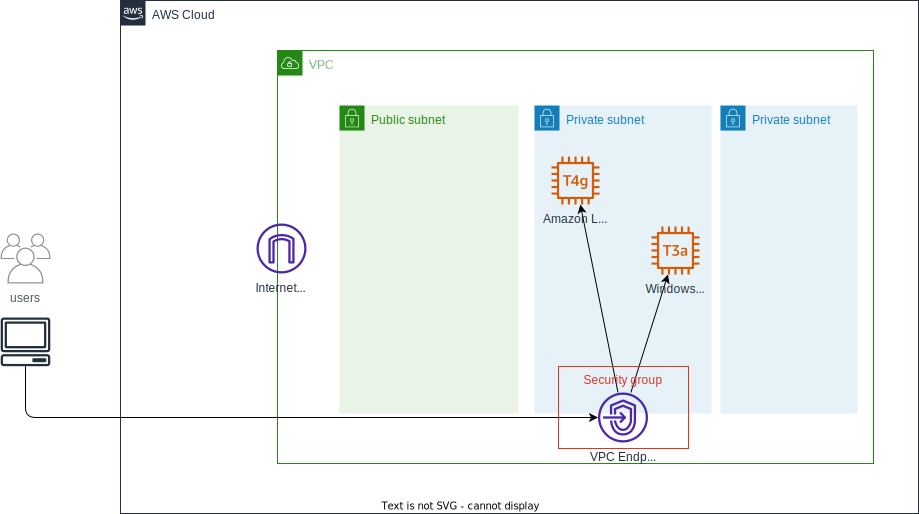

# Session Manager EC2 Over VPC Endpoint

## アーキテクチャ

- Create VPC and Subnets
- Create VPC Endpoint and Security Group
  - com.amazonaws.region.ssm
  - com.amazonaws.region.ssmmessages
  - com.amazonaws.region.ec2messages
- Create Test EC2 Instance and Security Group
  - Amazon Linux 2023
  - Windows Server 2022

## 料金

[Session Manager EC2 Over VPC Endpoint - AWS 料金見積りツール](https://calculator.aws/#/estimate?id=7878f74ff586756e0ea3dabc0c16d82b0902a46d)